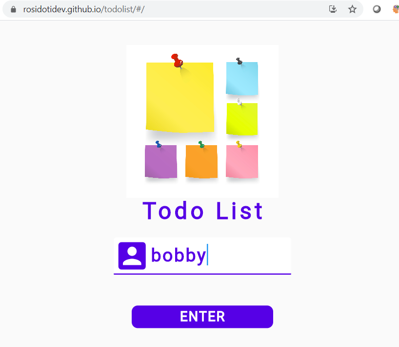
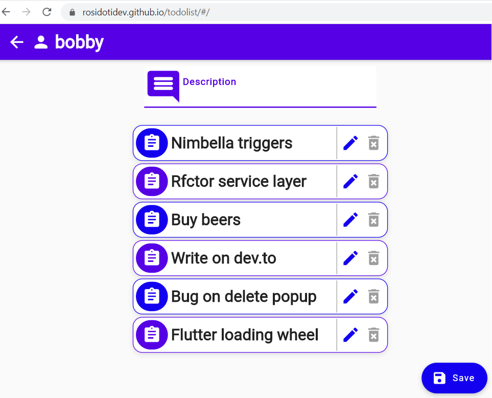

# flutter web todolist
Flutter 2.0 web todolist

This web project needs backend APIs that can be found at [nimbella todolist api](https://github.com/rosidotidev/nimbella_todolist_api) <br/>

#### Supported features:
- Access to a personal todolit
- List/Create/Update/Delete Todolist items

#### Getting Started:

0. You need to build the back end API and then you need to run <br/>
1. Clone the repo from https://github.com/rosidotidev/flutter_web_todolist.git
2. run ```flutter build web ```
3. run ```flutter run -d chrom ```

#### Screenshots:

 <br>

#### Credits:

- GetX framework (Best state management library)
- Dio http dart module
